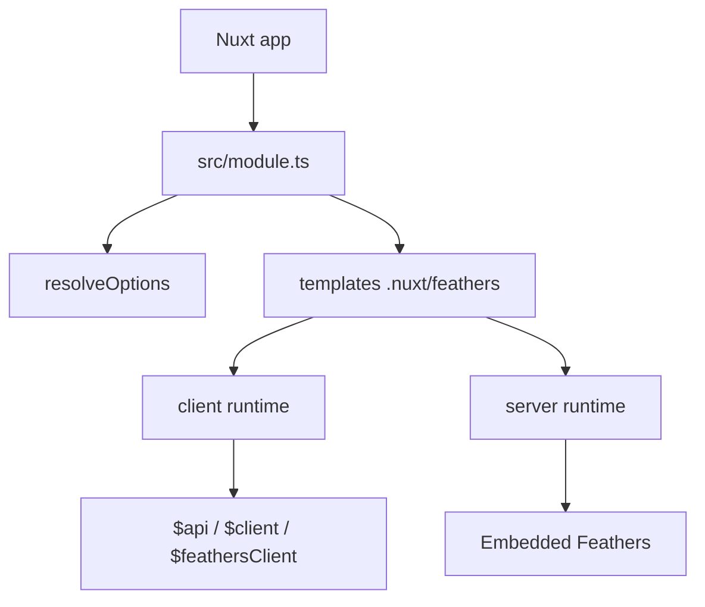

# Architecture

`nuxt-feathers-zod` combines a Nuxt 4 module, a generated runtime in `.nuxt/feathers/**`, a Bun CLI, and two execution modes.

## Overview

## Embedded boot order

1. resolve options
2. generate `.nuxt/feathers/**`
3. create Feathers app
4. load generated auth / mongodb plugins
5. load scanned services
6. load `server/feathers/**` plugins
7. run `server/feathers/modules/**` server modules
8. `await app.setup()`
9. mount Nitro REST / Socket.io routers
