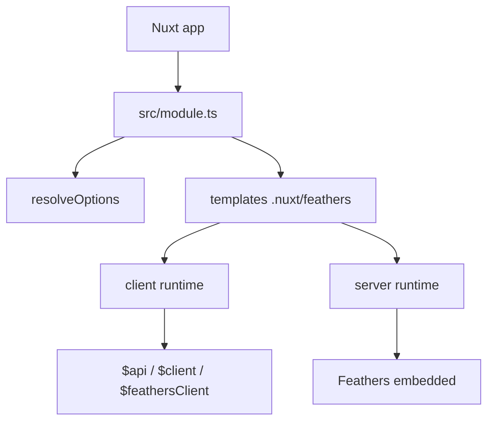

# Architecture

`nuxt-feathers-zod` combine un module Nuxt 4, un runtime généré dans `.nuxt/feathers/**`, une CLI Bun et deux modes d'exécution.

## Vue d'ensemble



## Modes

### Embedded

```mermaid
graph TD
  N[Nuxt] --> Nitro[Nitro]
  Nitro --> Plugin[feathers/server/plugin.ts]
  Plugin --> App[createFeathersApp()]
  App --> Services[services/**]
  App --> Plugins[server/feathers/**]
  App --> Modules[server/feathers/modules/**]
  Plugin --> Rest[/feathers/*]
  Plugin --> WS[/socket.io]
```

### Remote

```mermaid
graph TD
  U[Nuxt app] --> C[Feathers client]
  C --> API[Remote Feathers API]
  API --> REST[/feathers/*]
  API --> WS[/socket.io]
```

## Ordre d'initialisation embedded

1. résolution des options
2. génération des fichiers `.nuxt/feathers/**`
3. création de l'application Feathers
4. chargement auth / mongodb générés
5. chargement des services scannés
6. chargement des plugins `server/feathers/**`
7. exécution des server modules `server/feathers/modules/**`
8. `await app.setup()`
9. montage des routes Nitro REST / Socket.io
